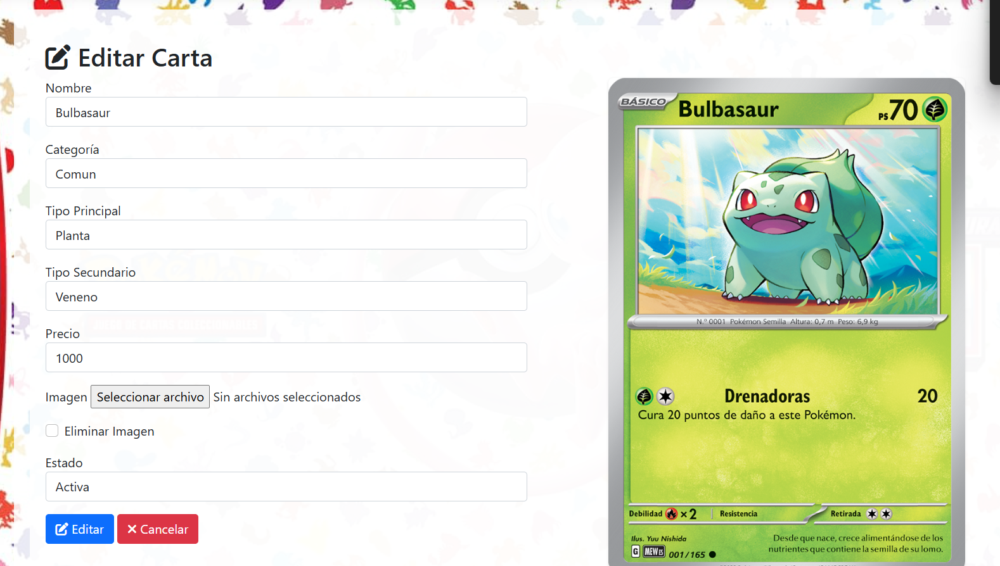

# 🃏 Tienda y Plataforma de Intercambio de Cartas Pokémon

Aplicación web **MVC** hecha con **ASP.NET Core** que simula una tienda y plataforma de intercambio de cartas coleccionables Pokémon. Los usuarios pueden comprar cartas con puntos virtuales, armar colecciones y hacer intercambios entre sí, con un panel de administración completo por detrás.

## 🖼️ Vista previa



*Panel de administración para editar cartas: nombre, categoría, tipos, precio, imagen y estado — con vista previa de la carta en tiempo real al estilo TCG.*

## ✨ Funcionalidades

- **Gestión de usuarios con dos roles**: Administradores (CRUD completo sobre usuarios, cartas, colecciones y compras) y Usuarios Comunes (gestionan su propio perfil y puntos virtuales).
- **Tienda virtual**: compra de cartas con puntos virtuales, stock gestionado por el administrador.
- **Sistema de intercambios**: los usuarios pueden ofrecer hasta 5 cartas por intercambio; el receptor acepta, rechaza o cancela, y el oferente confirma antes de que las cartas se transfieran. Solo puede haber un intercambio abierto por par de usuarios, con vencimiento por tiempo.
- **Colecciones públicas**: cada usuario arma sus colecciones, visibles para otros usuarios.
- **Packs de cartas**: apertura de sobres/packs (gestión vía `PackController`).
- **Historial**: seguimiento de compras e intercambios propios.
- **Autenticación dual**: cookies para el sitio web + JWT para la API (`Api/UsuarioApiController`), pensada para un futuro cliente externo (app mobile, etc.).

## 🛠️ Stack tecnológico

| Categoría | Tecnología |
|---|---|
| Backend | ASP.NET Core 8 (MVC + Web API) |
| Lenguaje | C# |
| Base de datos | MySQL |
| ORM | Entity Framework Core + Pomelo.EntityFrameworkCore.MySql |
| Autenticación | Cookie Authentication (web) + JWT Bearer (API) |
| Vistas | Razor (.cshtml) |
| Imágenes | LazZiya.ImageResize |

## 📂 Estructura del proyecto

```
MiProyecto/
├── Api/                # Controlador API con auth JWT (UsuarioApiController)
├── Controllers/          # Carta, Coleccion, Compra, Intercambio, Pack, Usuario, Home
├── Models/                 # Entidades + interfaces y repositorios (patrón Repository)
├── Views/                    # Vistas Razor por controlador
└── wwwroot/                    # Assets, imágenes de cartas/packs y script SQL de la base
```

El acceso a datos usa el **patrón Repository**: cada entidad tiene su interfaz (`IRepositorioX`) y su implementación (`RepositorioX`), inyectadas por dependencia en `Program.cs`.

## 🚀 Cómo correrlo localmente

### Requisitos previos
- [.NET 8 SDK](https://dotnet.microsoft.com/download)
- MySQL Server

### Pasos

1. Cloná el repositorio:
   ```bash
   git clone https://github.com/RamonAlcaraz1987/TiendaCambiosCartasColeccionables.git
   cd TiendaCambiosCartasColeccionables
   ```

2. Creá la base de datos y cargá el esquema incluido:
   ```bash
   mysql -u root -p < "wwwroot/Uploads/pokemoncartas (26).sql"
   ```

3. Configurá la cadena de conexión en `appsettings.json` con tus credenciales de MySQL:
   ```json
   "ConnectionStrings": {
     "DefaultConnection": "Server=localhost;Database=pokemoncartas;User=root;Password=TU_PASSWORD;"
   }
   ```

4. Restaurá dependencias y corré el proyecto:
   ```bash
   dotnet restore
   dotnet run
   ```

5. Abrí `https://localhost:5001` (o el puerto que indique la consola) en tu navegador.

> ⚠️ **Nota de seguridad**: el `Salt` y el `TokenAuthentication:SecretKey` están hardcodeados en `appsettings.json`. Antes de desplegar en producción, movelos a variables de entorno o a un gestor de secretos (`dotnet user-secrets` en desarrollo).

## 📌 Estado del proyecto

Funcionalidades core implementadas: tienda, colecciones, intercambios, packs y roles de usuario. Próximas mejoras sugeridas:
- [ ] Mover credenciales sensibles a variables de entorno
- [ ] Agregar tests automatizados
- [ ] Documentar los endpoints de la API (Swagger/OpenAPI)

## 👤 Autor

**Ramón Alcaraz**
[LinkedIn](https://www.linkedin.com/in/ramon-alcaraz-arg/) · [GitHub](https://github.com/RamonAlcaraz1987)
